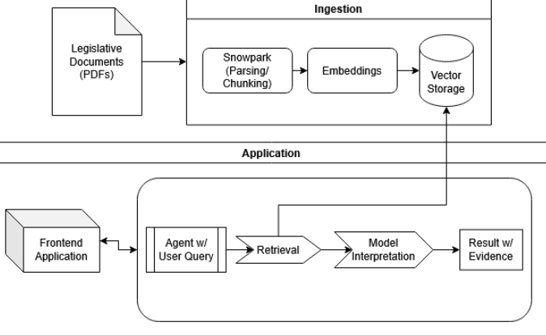

# PolicyPulse: A Snowflake-Native Trust-Aware Legislative Intelligence Copilot

**CS 5542 Big Data Analytics and Applications** — Project Proposal

---

## Team Members

| Name           | GitHub |
|----------------|--------|
| Salman Mirza   | [@SalmanM1](https://github.com/SalmanM1) |
| Kailynn Barnt  | [@kbrh3](https://github.com/kbrh3) |
| Max DeJesus    | [@max-dejesus](https://github.com/max-dejesus) |

**Repository:** [https://github.com/kbrh3/5542SemesterProject](https://github.com/kbrh3/5542SemesterProject)

---

## Problem Statement and Objectives

### Real-World Problem

Legislative text is long, technical, and frequently ambiguous. Analysts must interpret provisions precisely, trace definitions across sections, and connect narrative claims to structured facts (votes, sponsors, timelines). Existing tools rarely unify these sources with strong grounding guarantees. Generic chatbots can omit constraints, hallucinate details, or contradict themselves—which is legally dangerous in policy settings.

### Target Users and Decisions Improved

- **Policy Analysts / Staffers:** Rapidly assess what a bill changes, identify constraints, and produce evidence-linked briefings.
- **Journalists / Researchers:** Verify claims, quantify support/opposition, and trace where a policy change is located in the text.
- **Civic Users:** Ask concrete questions and receive answers with citations, not unsupported claims.

### Objectives

- Ingest legislative corpora (bills, amendments, metadata) at scale into a **Snowflake-centered** pipeline.
- Perform **hybrid retrieval** over bill text and **verified NL2SQL** over voting/metadata tables.
- Deliver **verifiable answers** with citation trails and execution-based proof for numeric claims.
- Add a **Trust + Ambiguity governance layer:** Trust Score (evidence coverage vs. unsupported generation) and Ambiguity Flag (explicit multi-interpretation when text is vague).

---

## System Architecture

PolicyPulse is a compound AI system with two main phases: **Ingestion** and **Application.**

- **Ingestion:** Legislative PDFs → Snowpark (parsing/chunking) → Embeddings → Vector Storage.
- **Application:** User query → Agent → Retrieval (from vector storage) → Model interpretation → Result with evidence → Frontend.

A full pipeline overview and query-time behavior are described in the [proposal](proposal/Data_Analytics_Project_Proposal.pdf).

---

## Repository Structure

| Path | Contents |
|------|----------|
| **[/proposal](proposal/)** | Project proposal PDF and submission materials |
| **[/docs](docs/)** | System diagrams, design notes, and updates |
| **[/reproducibility](reproducibility/)** | How to run data, code, and experiments |
| **[/papers](papers/)** | Reference papers and related work (PDFs) |

---

## Related Work — Research Papers (NeurIPS 2025, with Code)

### 1. ALIGNRAG: Test-Time Critique & Optimization for RAG Reasoning

- **Paper:** [NeurIPS 2025 Poster 115212](https://neurips.cc/virtual/2025/poster/115212)
- **Code:** [RAG-ReasonAlignment](https://github.com/upup-wei/RAG-ReasonAlignment)

**Summary.** ALIGNRAG identifies “reasoning misalignment” where the model retrieves relevant evidence but fails to align its final reasoning with that evidence. It introduces a critic model that iteratively critiques and improves the answer at inference time, with dynamic stopping to avoid over-editing.

**Integration with PolicyPulse.** We adapt the critic loop to legislative interpretation: the critic checks whether each claim maps to a cited bill chunk or a verified SQL result. We implement a Snowflake-centric “critique table” that logs claim-level grounding and computes the Trust Score.

---

### 2. CoRAG: Chain-of-Retrieval Augmented Generation

- **Paper:** [NeurIPS 2025 Poster 111522](https://neurips.cc/virtual/2025/poster/111522)
- **Code:** [LMOps/corag](https://github.com/microsoft/LMOps/tree/main/corag)

**Summary.** CoRAG addresses multi-hop information needs by chaining retrieval steps instead of one-shot retrieval. It improves complex query answering by explicitly retrieving intermediate evidence that supports later reasoning steps.

**Integration with PolicyPulse.** Legislative questions often require multi-hop retrieval (definitions → exceptions → enforcement). We use chained retrieval inside Snowflake, with each hop logged (hop id, chunk ids, citations) for reproducible audits.

---

### 3. SQL-R1: Training NL2SQL Reasoning via Reinforcement Learning

- **Paper:** [NeurIPS 2025 Poster 116624](https://neurips.cc/virtual/2025/poster/116624)
- **Code:** [SQL-R1](https://github.com/IDEA-FinAI/SQL-R1)

**Summary.** SQL-R1 improves NL2SQL in complex multi-table and nested-query scenarios by training a reasoning-focused model with reinforcement learning. It targets the gap between syntactically valid SQL and semantically correct SQL that matches user intent.

**Integration with PolicyPulse.** We apply NL2SQL to legislative schemas (votes, bill metadata, sponsors, committees). We combine SQL-R1-style reasoning with execution-based verification (run SQL, detect anomalies, re-ask/repair) and store verified SQL + outputs as provenance for the Trust Score.

---

## Data Sources

### 1. US Congress Bills – Text and Metadata (Kaggle)

- **Link:** [US Congress Bills - Text and Metadata](https://www.kaggle.com/datasets/danielpace725/us-congress-bills-text-and-metadata)
- **Description:** Recent U.S. congressional bills with full text, summaries, and metadata (bill IDs, titles, timestamps). **Modality:** text + tabular metadata. **Size:** thousands of bills. **Update frequency:** snapshot/periodic as new Congress data is released.
- **Snowflake ingestion:** Raw files in cloud/local → Snowflake stage; Snowpipe for batch/continuous load; Snowpark to normalize and build analytic views; section-aware chunking and embeddings for vector retrieval.

### 2. BillSum (Kaggle)

- **Link:** [BillSum](https://www.kaggle.com/datasets/akornilo/billsum)
- **Description:** Corpus for summarization of U.S. legislation: bill text and reference summaries. **Modality:** long-form text + summaries. **Size:** ~22k+ US Congressional bills (103rd–115th Congress, 1993–2018). **Update frequency:** static research corpus.
- **Snowflake ingestion:** Load as (bill id, text, reference summary); use as evaluation set for summary faithfulness, citation precision, and ambiguity detection.

### 3. Congressional Voting Records (Voteview, Kaggle)

- **Link:** [Congressional Voting Records](https://www.kaggle.com/datasets/voteview/congressional-voting-records)
- **Description:** Roll call votes and related descriptive/ideological metadata for the U.S. Congress. **Modality:** structured tables (votes, members, rollcalls, parties). **Size:** historical roll-call data (1st Congress onward). **Update frequency:** updated as new votes are recorded (periodic/live).
- **Snowflake ingestion:** Load CSV/Parquet into relational tables with keys; star schema (fact votes, dim member, dim bill/rollcall); schema documentation for NL2SQL.

---

## Reproducibility

Data download, Snowflake setup, pipelines, and evaluation are described in the **[reproducibility](reproducibility/)** folder. The plan includes:

- Data download (e.g., Kaggle API) and version notes  
- Snowflake setup (DB, schema, tables, stages, roles)  
- Snowpark ingest, transforms, chunking  
- Evaluation harness and experiment logs  

---

## References (Domain & System)

- Beauchemin, D., et al. (2025). *JUDGEBERT: Assessing Legal Meaning Preservation Between Sentences.* EMNLP 2025.
- Kapoor, S. M., & Banerjee, S. (2024). *Chatting With Your Data: LLM-Enabled Data Transformation for Enterprise Text to SQL.* University of Cambridge.
- Janssen, M., et al. (2020). *Data Governance: Organizing Data for Trustworthy Artificial Intelligence.* Government Information Quarterly.

---

*PolicyPulse — RAG project for CS 5542 (Masters level).*
